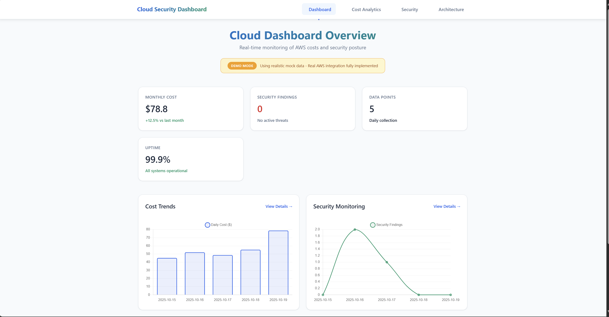
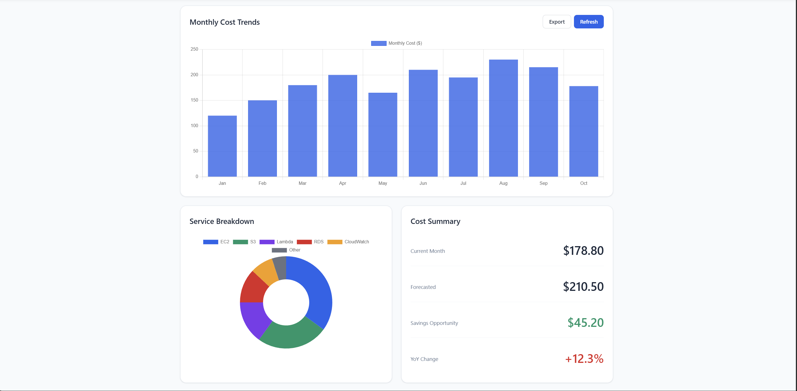
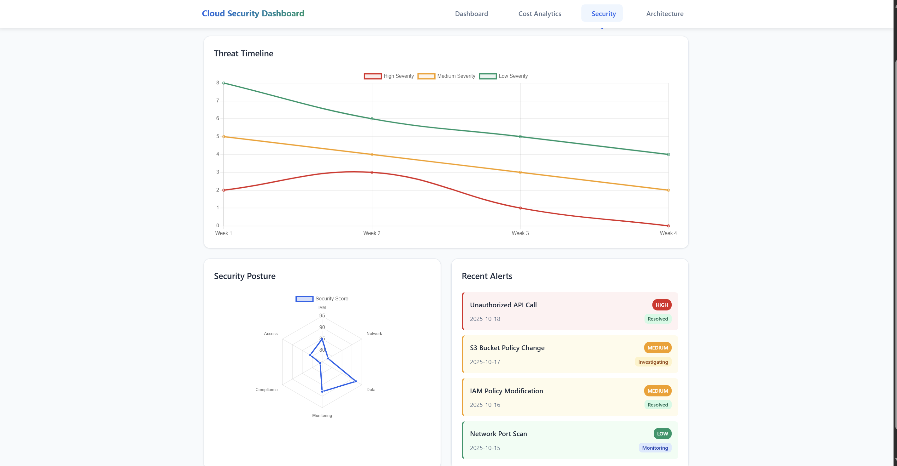

# Cloud Cost & Security Dashboard

A full-stack cloud monitoring solution built with AWS serverless stack and Terraform. Automatically tracks AWS costs and security findings with real-time dashboard visualization.

## Live Demo
[View Dashboard](https://cloud-security-dashboard-pranay.netlify.app/)

**Note**: Public demo uses realistic mock data. Real AWS integration fully implemented and tested.

## Project Overview
- Infrastructure as Code with Terraform
- Serverless Architecture using AWS Lambda and DynamoDB
- Real-time Monitoring of AWS Cost Explorer and GuardDuty
- Multi-page React Dashboard with data visualization
- Free Tier Compliant design
- Security-First implementation

## Key Features
- Automated daily cost collection from AWS Cost Explorer
- Real-time security monitoring via AWS GuardDuty
- Interactive charts and analytics dashboard
- Multi-page responsive web application
- Infrastructure as Code deployment

## Technology Stack
- Cloud: AWS Lambda, DynamoDB, S3, CloudWatch, IAM
- Infrastructure: Terraform, EventBridge
- Backend: Python 3.9, Boto3 SDK
- Frontend: React 18, Chart.js, React Router
- Deployment: Netlify

## Quick Links
- [System Architecture](ARCHITECTURE.md)
- [Technical Implementation](TECHNICAL_DETAILS.md)
- [Deployment Guide](DEPLOYMENT.md)
- [Code Samples](CODE_SAMPLES.md)

## Development Timeline
- Day 1: Infrastructure setup with Terraform
- Day 2: Backend integration and data processing
- Day 3: Frontend dashboard and deployment